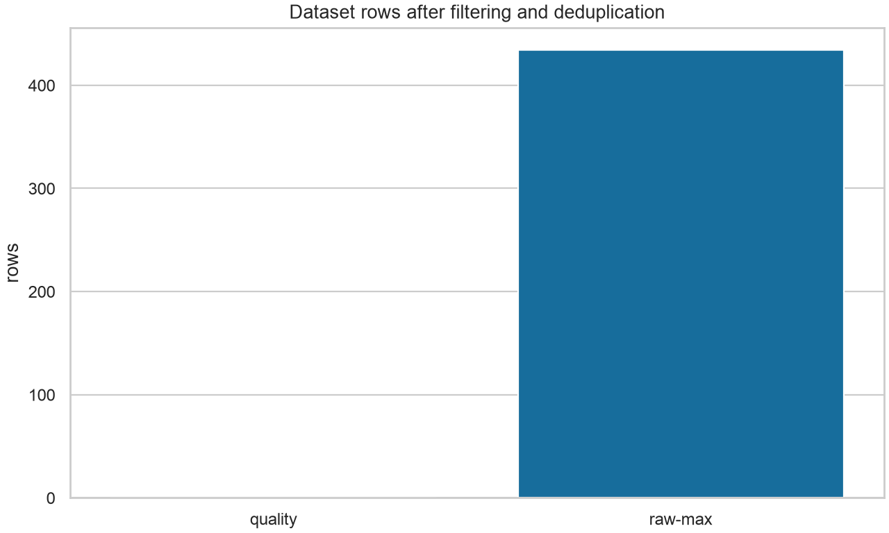
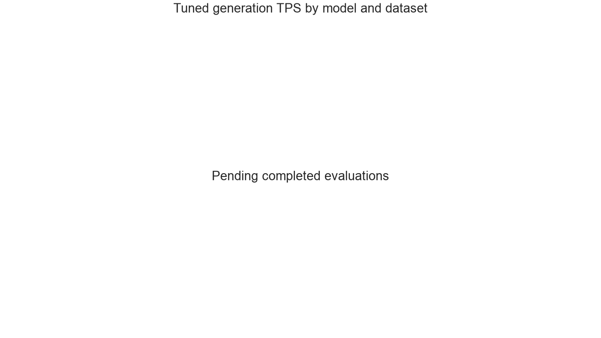
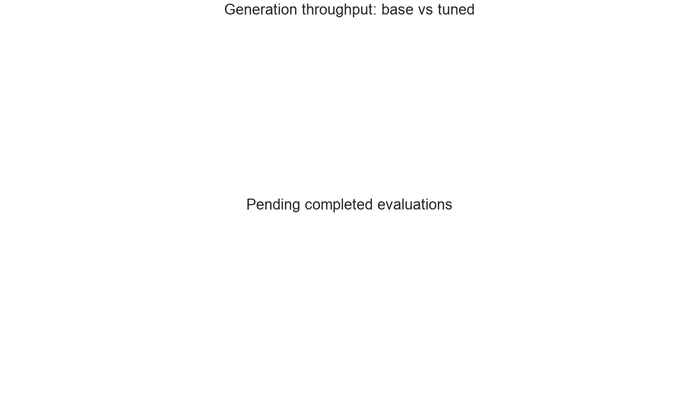
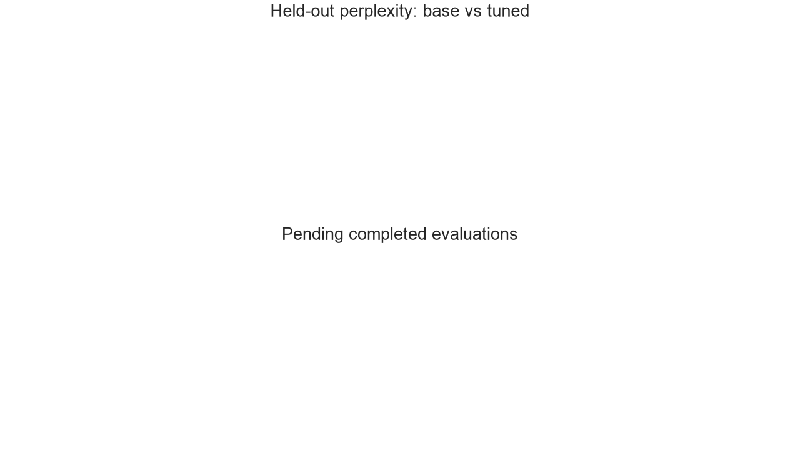
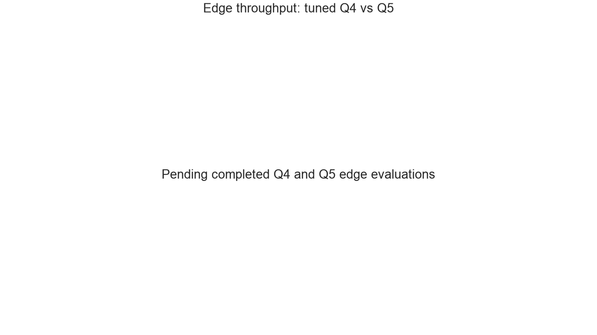
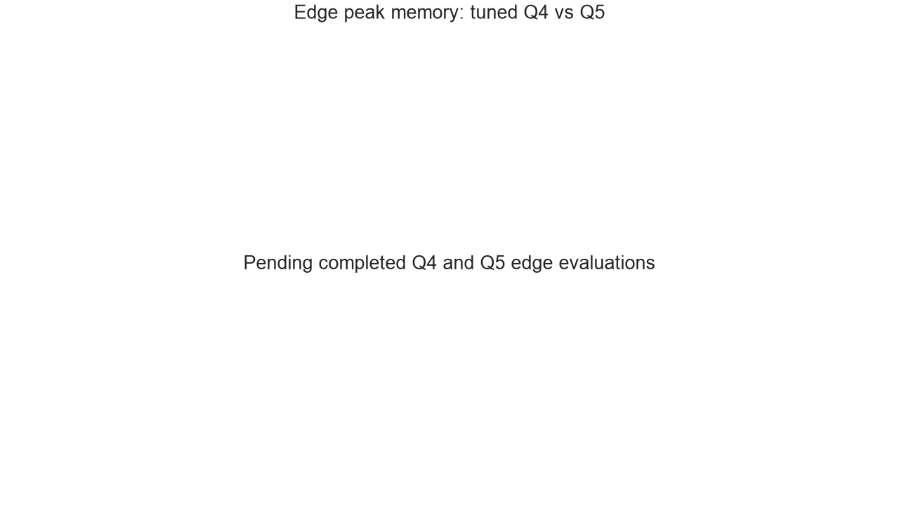

# Personal-code MLX LoRA comparison

Generated: 2026-07-16T12:52:12+00:00  
Canonical evaluation data: [`results.json`](results.json)

## Status

0 completed, 8 pending, 0 errored evaluations. “Pending” is intentional:
the report never substitutes estimates for unrun training or evaluation.

## Personal contribution statistics

| Commits | Added | Removed | Net LOC | Source |
| --- | --- | --- | --- | --- |
| 223 | 61,030 | 10,886 | 50,144 | [stats.json](../stats/stats.json) → overall |

## Dataset comparison

| Variant | Rows | Train | Valid | Lexical tokens | Languages | Repos | Source |
| --- | --- | --- | --- | --- | --- | --- | --- |
| quality | 0 | 0 | 0 | 0 | 0 | 0 | [statistics.json](../datasets/quality/statistics.json) |
| raw-max | 434 | 215 | 219 | 393,314 | 8 | 2 | [statistics.json](../datasets/raw-max/statistics.json) |

Chart source: each listed `datasets/<variant>/statistics.json`.

## Model comparison

| Model | Quantization | Optimization | Dataset | Status | Base TPS | Tuned TPS | TPS Δ | Base PPL | Tuned PPL | Tuned exact | Source |
| --- | --- | --- | --- | --- | --- | --- | --- | --- | --- | --- | --- |
| gemma-4-e2b-4bit | Q4 | MLX native | raw-max | pending | pending | pending | pending | pending | pending | pending | [results.json](results.json) → evaluations[0] |
| gemma-4-e2b-4bit | Q4 | MLX native | quality | pending | pending | pending | pending | pending | pending | pending | [results.json](results.json) → evaluations[1] |
| gemma-4-e2b-5bit | Q5 | MLX native | raw-max | pending | pending | pending | pending | pending | pending | pending | [results.json](results.json) → evaluations[2] |
| gemma-4-e2b-5bit | Q5 | MLX native | quality | pending | pending | pending | pending | pending | pending | pending | [results.json](results.json) → evaluations[3] |
| gemma-4-e4b-4bit | Q4 | MLX native | raw-max | pending | pending | pending | pending | pending | pending | pending | [results.json](results.json) → evaluations[4] |
| gemma-4-e4b-4bit | Q4 | MLX native | quality | pending | pending | pending | pending | pending | pending | pending | [results.json](results.json) → evaluations[5] |
| gemma-4-e4b-5bit | Q5 | MLX native | raw-max | pending | pending | pending | pending | pending | pending | pending | [results.json](results.json) → evaluations[6] |
| gemma-4-e4b-5bit | Q5 | MLX native | quality | pending | pending | pending | pending | pending | pending | pending | [results.json](results.json) → evaluations[7] |

### Edge deployment comparison

Chart sources: `results.json → evaluations[*].base`, `.tuned`, and `.comparison`.
The edge charts group like-for-like model families and datasets using
`evaluations[*].model.quantization_bits` and the tuned throughput and peak-memory measurements.

## Methodology

Configuration source: [`config.yaml`](../config.yaml).

Repositories are walked at their checked-out state, filtered by `config.yaml`, chunked to an
approximate lexical-token target, exact-deduplicated by SHA-256, and near-deduplicated by MinHash.
The deterministic 95/5 target split is assigned by repository, so no repository appears in both
train and valid. With fewer than two retained repositories the valid split is empty rather than
leaking chunks across splits. Dataset parameters and actual split assignments are recorded in each
variant's `statistics.json`.

Training uses MLX-VLM LoRA on paired 4-bit (Q4) and 5-bit (Q5) Gemma 4 bases, batch size and
sequence caps from `config.yaml`, and one model at a time. The checkpoints are MLX-native for local
Apple Silicon deployment. Vision and audio towers remain frozen; training rows contain text-only
code prefix/completion pairs. No `bitsandbytes` or CUDA training path is involved. Run inputs, logs,
adapter paths, and wall times are recorded under `runs/<run>/`.

Evaluation samples only `valid.jsonl`. TPS is MLX-VLM's measured generation throughput after the
configured warm-up runs. Perplexity is exponentiated mean next-token cross-entropy on held-out
tokens. Next-line exact match compares the first generated line with a withheld source line. The
exact limits, sample counts, scored tokens, repeated-run dispersion, and peak memory are stored in
`results.json` for every completed condition.

## Limitations

- This is a repo-walked corpus, not a curated set of accepted or known-correct solutions.
- Personal data is small and correlated; results should not be generalized to broad coding ability.
- LoRA adapts a subset of weights and is not a full-model fine-tune.
- Throughput and memory are Apple-Silicon-only numbers from the local machine and software stack.
- Q4 and Q5 bases change memory and numerical behavior; comparisons are only within like-for-like
  model families, datasets, and the recorded setup.
- Repository-level splitting avoids direct repository leakage but can leave no validation data for a
  one-repository corpus.
- File paths and code may contain secrets or identifying data. Review artifacts before publication.
- Source-repository licenses continue to govern retained code; dataset metadata does not override
  them.
