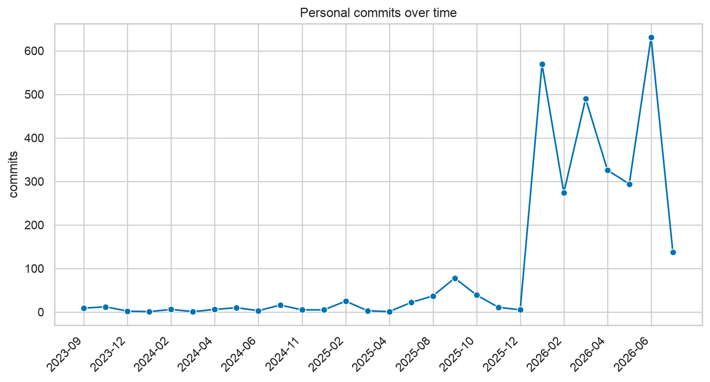
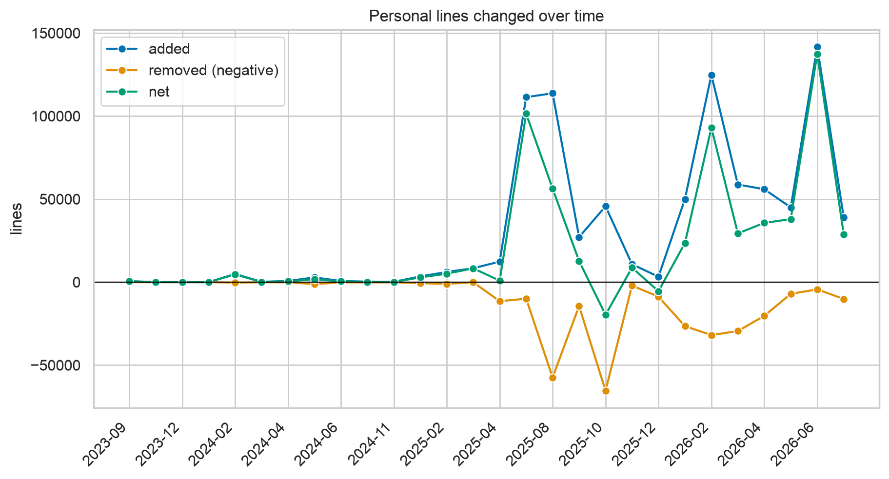
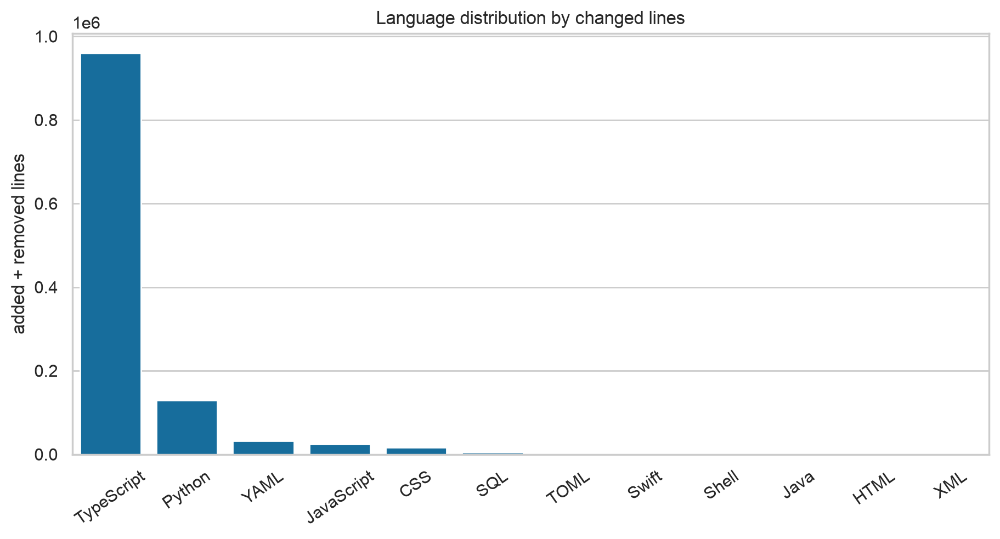

# Personal code statistics

Generated: 2026-07-16T14:15:45+00:00  
Canonical data: [`stats.json`](stats.json)

## Overall

| Commits | Lines added | Lines removed | Net LOC | Changed lines |
| --- | --- | --- | --- | --- |
| 3,018 | 868,278 | 302,760 | 565,518 | 1,171,038 |

## By repository

| Repository | Commits | Added | Removed | Net |
| --- | --- | --- | --- | --- |
| 1AHIF-BOT | 0 | 0 | 0 | 0 |
| Illegale_Strassenrennen-Webprojekt | 0 | 0 | 0 | 0 |
| InstagramFollowerBot | 0 | 0 | 0 | 0 |
| Kriegsmarine_Webprojekt | 0 | 0 | 0 | 0 |
| MSRP | 0 | 0 | 0 | 0 |
| POS-23-24-Java | 9 | 577 | 5 | 572 |
| Project-CB | 0 | 0 | 0 | 0 |
| Valorant-Webprojekt | 0 | 0 | 0 | 0 |
| adapter-lab | 123 | 13,884 | 91 | 13,793 |
| ai-video | 4 | 10,065 | 329 | 9,736 |
| asai | 7 | 0 | 0 | 0 |
| aucta | 207 | 23,073 | 5,492 | 17,581 |
| brz-chatbot | 5 | 792 | 534 | 258 |
| catchi | 15 | 22,707 | 422 | 22,285 |
| clawguard | 100 | 20,256 | 13,963 | 6,293 |
| codex-hackathon | 206 | 34,527 | 10,436 | 24,091 |
| cursor-austria | 6 | 2,222 | 77 | 2,145 |
| cursor-vienna-discord | 10 | 6,931 | 348 | 6,583 |
| datagvat-mcp | 744 | 97,264 | 59,749 | 37,515 |
| daytona-generative-ui | 17 | 135,437 | 104,566 | 30,871 |
| diplomarbeit-ideen | 17 | 26,503 | 450 | 26,053 |
| diplomarbeit-os | 608 | 107,137 | 3,188 | 103,949 |
| ewor-skill | 2 | 0 | 0 | 0 |
| hacknation | 44 | 45,026 | 10,646 | 34,380 |
| hacknation-app | 0 | 0 | 0 | 0 |
| hacknation-landing | 2 | 18,509 | 0 | 18,509 |
| hacknation-venture | 4 | 1,153 | 187 | 966 |
| hacknation-web | 0 | 0 | 0 | 0 |
| hands-on-ai | 4 | 6,747 | 102 | 6,645 |
| htl-donaustadt-chatbot | 14 | 56 | 37 | 19 |
| html-starter | 0 | 0 | 0 | 0 |
| ifg-agentic | 40 | 108,065 | 28,287 | 79,778 |
| interior-3d | 11 | 2,042 | 20 | 2,022 |
| interiorly | 7 | 15,872 | 12,057 | 3,815 |
| interiorly-dashboard | 1 | 4,835 | 139 | 4,696 |
| interiorly-pitch | 14 | 2,683 | 845 | 1,838 |
| interiorly-preview | 6 | 393 | 183 | 210 |
| interiorly-promo-fake | 0 | 0 | 0 | 0 |
| interiorly_changelog | 6 | 1,168 | 4 | 1,164 |
| interiorly_landingpage | 2 | 8,336 | 42 | 8,294 |
| jku-assignments | 9 | 11,920 | 54 | 11,866 |
| jku-current-topics-report | 4 | 2,719 | 429 | 2,290 |
| jku-encyclopedia | 376 | 34,176 | 5,920 | 28,256 |
| jku-python | 3 | 0 | 0 | 0 |
| julian-at | 0 | 0 | 0 | 0 |
| mlpc-2026-task3 | 5 | 14,323 | 5,095 | 9,228 |
| mlpc-exam | 5 | 6,581 | 178 | 6,403 |
| mlpc_task_4 | 31 | 3,859 | 164 | 3,695 |
| mystahd | 1 | 192 | 74 | 118 |
| next-todo | 3 | 713 | 131 | 582 |
| openai-build-week | 35 | 13,581 | 8,832 | 4,749 |
| portfolio | 89 | 17,200 | 10,188 | 7,012 |
| qdrant-hackathon | 85 | 29,075 | 14,396 | 14,679 |
| start-hackathon | 54 | 7,273 | 3,195 | 4,078 |
| synth-ui | 17 | 291 | 174 | 117 |
| synth-ui-training | 1 | 22 | 0 | 22 |
| tdot_chatbot | 0 | 0 | 0 | 0 |
| untis-lehrer-extension | 0 | 0 | 0 | 0 |
| young_ai_leaders_linz | 43 | 4,566 | 1,080 | 3,486 |
| zero_one_hack_01 | 22 | 5,527 | 651 | 4,876 |

## By language

Language commit counts count a commit once for every retained language it touches.

| Language | Commits | Added | Removed | Net | Changed |
| --- | --- | --- | --- | --- | --- |
| TypeScript | 1,079 | 694,800 | 264,736 | 430,064 | 959,536 |
| Python | 313 | 110,038 | 19,476 | 90,562 | 129,514 |
| YAML | 73 | 23,322 | 9,635 | 13,687 | 32,957 |
| JavaScript | 138 | 21,455 | 2,488 | 18,967 | 23,943 |
| CSS | 123 | 11,640 | 4,731 | 6,909 | 16,371 |
| SQL | 48 | 3,453 | 809 | 2,644 | 4,262 |
| TOML | 37 | 962 | 596 | 366 | 1,558 |
| Swift | 8 | 1,072 | 108 | 964 | 1,180 |
| Shell | 19 | 943 | 159 | 784 | 1,102 |
| Java | 8 | 577 | 5 | 572 | 582 |
| HTML | 2 | 1 | 17 | -16 | 18 |
| XML | 1 | 15 | 0 | 15 | 15 |

## By year

| Year | Commits | Added | Removed | Net |
| --- | --- | --- | --- | --- |
| 2023 | 23 | 633 | 42 | 591 |
| 2024 | 48 | 9921 | 2080 | 7841 |
| 2025 | 226 | 342359 | 171074 | 171285 |
| 2026 | 2721 | 515365 | 129564 | 385801 |

## Charts

All chart values come from `stats.json → over_time` or `stats.json → by_language`.

## Methodology and limits

Commits are matched case-insensitively against local `git config user.email`, configured aliases,
and `--emails` values. `git log --all --numstat --find-renames` supplies additions and removals
without treating a pure rename as delete-and-readd churn.
Binary changes, gitignored current paths, excluded/generated/vendored directories and patterns,
lockfiles, minified files, and unsupported extensions use the dataset builder's filter rules.
Git cannot apply today's ignore or file-size rules to a deleted historical path that no longer
exists, so such a path is filtered only by its historical name and extension. Net LOC is additions
minus removals; it is contribution churn, not the current checkout's physical line count.
